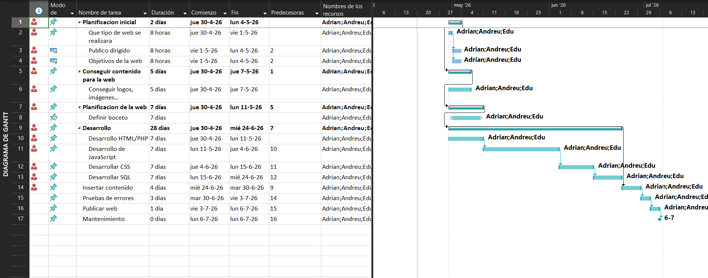
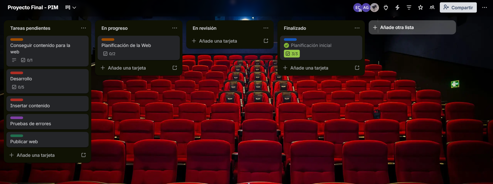
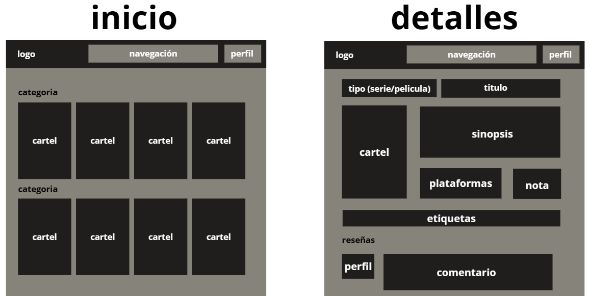
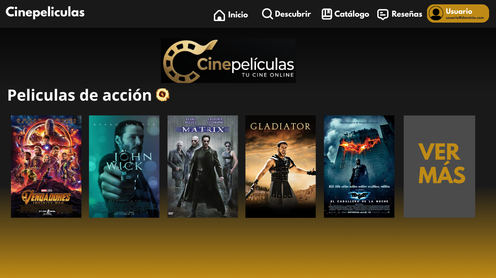
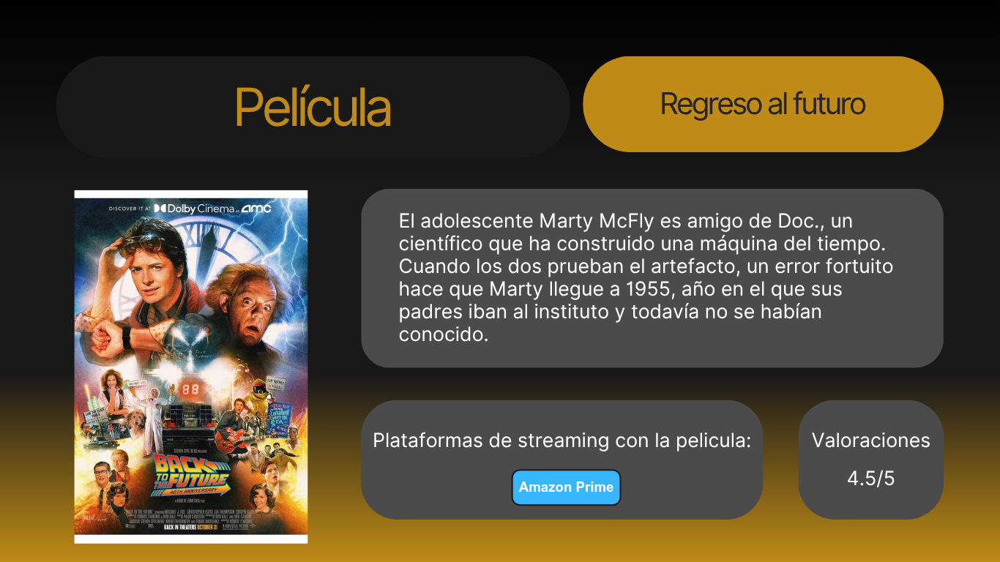

# 🎞️ Cinepeliculas.com
``Els emojis i el text han sigut colocats manualment. Ninguna IA ha sigut utilitzada en aquest projecte.``
### 🫂 Equipo formado por:
- Adrián
- Edu
- Andreu

## 📕 Índice
- [Fase 1 - Creación del equipo y el entorno.](#fase-1)
- [Fase 2 - Definición del proyecto.](#fase-2)
- [Fase 3 - Planificación del proyecto.](#fase-3)
- [Fase 4 - Metodología de trabajo.](#fase-4)

#### Fase 1
## 1️⃣ Creación del equipo y el entorno.
- La estructura de carpetas del proyecto es este mismo repositorio de GitHub.
- El Teams también se ha creado:
  

#### Fase 2
## 2️⃣ Definición del proyecto.
- ### __Qué web/aplicación se va a diseñar__
  Un catálogo detallado de películas y series de todas las plataformas de streaming, televisión, directo, cine, etc.
- ### __Cuál es su objetivo__
  Crear catálogo de películas y series donde todas las entradas estén separadas por categorías como género, tematica, duración, año/época...
- ### __A qué público va dirigida__
  El publico principal al que va enfocado el catálogo es a una audiencia joven o adulta, aunque también hay categorías ianfantiles.
- ### __Que problema(s) resuelve__
  El pasar más tiempo viendo buscando el qué ver que viendo algo. El querer ver una serie o película pero no saber en que plataformas está disponible + su precio.

#### Fase 3
## 3️⃣ Planificación del proyecto.
- ### __Diagrama de Gantt__
  

- ### __Tablero de Trello__
  

#### Fase 4
## 4️⃣ Metodología de trabajo.
Para ese proyecto hemos decidido usar la metodología Kanban mediante la plataforma Trello. Esta metodología es más simple y visual, permitiéndonos saber con tan solo un vistazo rápido las tareas pendientes de cada uno y el estado general del proyecto.

Las reuniones se organizarán semanalmente mediante Teams. En estas reuniones se evaluará el progreso del proyecto y se asignarán nuevas tareas a cada integrante del grupo.

#### Fase 5
## 5️⃣ Diseño de la web.
- ### __Wireframe__

- ### __Inicio__
Aquí se muestran peliculas y series recomendadas para el usuario, tendencias y novedades.
- ### __Descubrir__
Aquí se muestran todas las películas y series indexadas en la web ordenadas y clasificadas por etiquetas.
- ### __Mi catálogo__
Películas y series guardadas por el usuario para ver más tarde o favoritas.
- ### __Reseñas__
Registro de las interacciones que ha hecho el usuario: Reseñas a peliculas o series y respuestas a comentarios de otros usuarios.

#### Fase 6
## 6️⃣ Prototipo visual
- ### __Pagina principal de la web__
  

  Hemos decididido darle un toque oscuro como la sala de un cine donde se dividiran en secciones las peliculas que quiere buscar el usuario segun que tipo de pelicula desearia ver.

- ### __Pagina de informacion detallada de la pelicula__
  

  Una vez el usuario haya encontrado una pelicula que le interese podra ver informacion mas detallada de esta con una sinopsis, la media de calificaciones, donde poder ver la pelicula...
