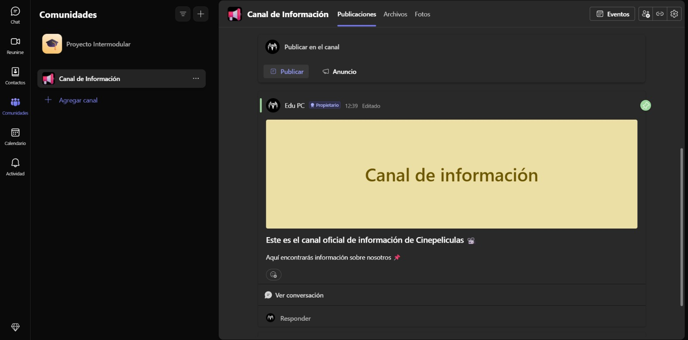

# Cinepeliculas.com
### Equipo formado por:
- Adrián
- Edu
- Andreu

## Índice
- [Fase 1 - Creación del equipo y el entorno.](#fase-1---creación-del-equipo-y-el-entorno)
- [Fase 2 - Definición del proyecto.](#fase-2---definición-del-proyecto)

## Fase 1 - Creación del equipo y el entorno.
- La estructura de carpetas del proyecto es este mismo repositorio de GitHub.
- El Teams también se ha creado:

## [Fase 2 - Definición del proyecto.](Fase_2.md)
- ### __Qué web/aplicación se va a diseñar__
  Un catálogo detallado de películas y series de todas las plataformas de streaming, televisión, directo, cine, etc.
- ### __Cuál es su objetivo__
  Crear catálogo de películas y series donde todas las entradas estén separadas por categorías como género, tematica, duración, año/época...
- ### __A qué público va dirigida__
  El publico principal al que va enfocado el catálogo es a una audiencia joven o adulta, aunque también hay categorías ianfantiles.
- ### __Que problema(s) resuelve__
  El pasar más tiempo viendo buscando el qué ver que viendo algo. El querer ver una serie o película pero no saber en que plataformas está disponible + su precio.
