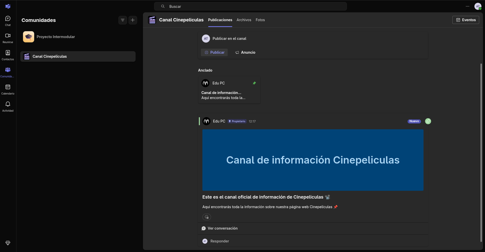

# DocsProjecte
Documentació projecte intermodular.

## Miembros del equipo:
- Adrián
- Edu
- Andreu

## Fases
- Fase 1 - Creación del equipo y el entorno.
  - La estructura de carpetas del proyecto es este mismo repositorio de GitHub.
  - El Teams también se ha creado:
  
- [Fase 2 - Definición del proyecto.](Fase_2.md)
